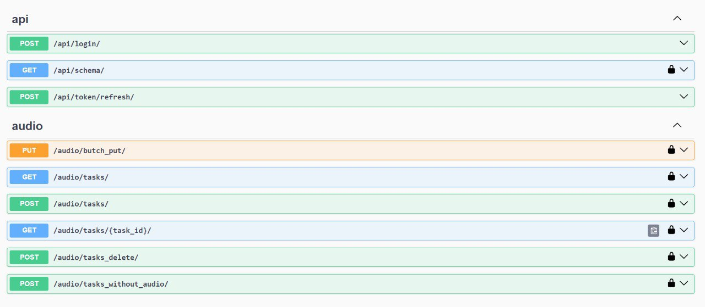
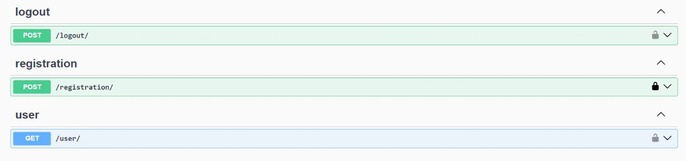

# Tz Renesandro

## Technology Stack
+ Django, DRF
+ PostgreSQL
+ Swagger
+ Docker, Docker-compose
+ Gunicorn

## Instruction to run a project with Docker

Before deploying the project, you need to configure the .env file, the project has .test.env
```
OPENAI_API_KEY=
```
With this api key you can access external api, in particular _platform OpenAI_

After installing this project on your pc, make sure you are on the right path, you should be level with the folder where the docker-compose.yml file is located. 
After that then enter the command 
```
docker-compose up -d --build
```
After all the actions, gathering the image and creating a container using this image, enter another command 
```
docker-compose exec web python manage.py migrate
```

With its help you will create migrations and can already finalize the product 

By this url you can achive the site [http://127.0.0.1:8000/](http://127.0.0.1:8000/)

Also if you need api docs for the site you can achive them by [http://127.0.0.1:8000/api/docs](http://127.0.0.1:8000/api/docs)



You can also directly access each path directly, for example as a path that leads to downloading and processing an audio file
[http://localhost:8000/audio/tasks/](http://localhost:8000/audio/tasks/)

